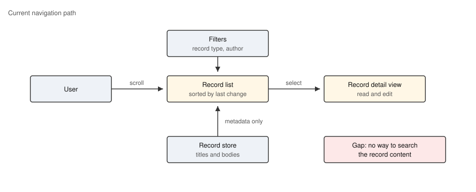
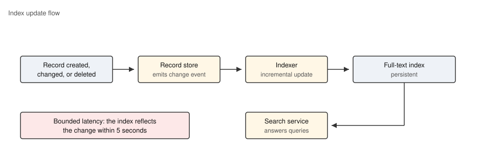

# Status

|  | Date | Status |
|:---:|---|---|
|   | 08-07-2026 | Proposed |
| * | 10-07-2026 | Accepted |
|   |  | In-Progress |
|   |  | Implemented |

# Context

Today the only way to find a record is to scroll the record list, narrowed down by the type and author filters. The list is sorted by the date of the last change, so a record that has not been touched for months sinks to the bottom and is effectively lost: the user remembers a phrase from the record body but has no way to search for it.

The sketch below shows the current navigation path. Every route to a record goes through the record list, and the list knows nothing about the record content.

Support requests confirm the pain: "how do I find the record where I wrote about X" is the most frequent question, and the workaround (export everything and grep the export) defeats the purpose of keeping the records in the application.

# Decision

The application shall provide full-text search over the title and body of all records. A dedicated search service answers queries from a persistent full-text index; the index is updated incrementally whenever a record changes, so search results follow the data with only a short delay.

The flow below shows how a record change propagates into the index and becomes findable.

The existing record list stays the single entry point for the results: a search query re-orders and narrows the same list instead of opening a separate results page, so the type and author filters keep working on top of search results.

# Scope

| # | Item | Owner | Depends On | Est (focused) | Est (safe) | Status | Start Date | Target Date | Description |
|---|---|---|---|---|---|---|---|---|---|
| 1 | Requirements | BA |  | 1 | 2 | To Do |  |  | Update the record navigation requirements and state the new search requirements listed under Affected Documents |
| 2 | Code | DEV | 1 | 5 | 8 | To Do |  |  | Search service, persistent full-text index, incremental indexer subscribed to record change events |
| 3 | Tests | TEST | 2 | 3 | 5 | To Do |  |  | Automated tests for indexing latency, ranking, and the interplay of search with the type and author filters |

# Out of Scope

- **Search inside file attachments.** Only the record title and body are indexed; attachment content stays opaque.
- **Fuzzy matching and synonyms.** The first iteration matches the entered words only; linguistic features are a possible follow-up decision.
- **Saved searches.** Persisting a query as a named shortcut is not part of this decision.

# Consequences

## Positive

- A record can be found by any phrase the user remembers from its content, regardless of how long ago it was changed.
- The record list remains the single navigation surface, so the existing filters and the detail view stay unchanged for the user.

## Negative

- The application gains a second persistent store (the index) that must be kept consistent with the record store and rebuilt after a restore from backup.

## Neutral

- Search results lag a record change by up to the indexing latency; the delay is bounded by a requirement and shown nowhere in the UI.

# Alternatives Considered

- **Direct SQL LIKE queries against the record store.** Rejected: no ranking, and the full scan is too slow beyond a few thousand records.
- **A separate search results page.** Rejected: it would duplicate the record list and break the established filter workflow.
- **Indexing synchronously inside the save transaction.** Rejected: it couples save latency to index health; an unavailable index would block editing.

# Affected Documents

The table below lists the requirements this decision updates or creates. The first three rows update requirements that already exist in the requirements specification, so their Req-IDs resolve into links. The last two rows are proposed requirements that do not exist in the specification yet, so their Req-IDs stay unresolved until the requirements work in the Scope table is done.

| # | Proposed Text | Req-ID |
|---|---|---|
| 1 | The software shall display the list of records sorted by the date of the last change, or by search relevance while a search query is active. | >[REQ-010] |
| 2 | The software shall allow the user to filter the record list by record type and by author, including while a search query is active. | >[REQ-011] |
| 3 | The software shall open a record in the detail view when the user selects it in the record list, including when the list shows search results. | >[REQ-012] |
| 4 | The software shall provide full-text search over the title and the body of all records and shall rank the matching records by relevance. | >[REQ-030] |
| 5 | The software shall update the full-text index within 5 seconds after a record is created, changed, or deleted. | >[REQ-031] |

# Software Versions

| Software Version Category | Software Version ID |
|---|---|
| Latest Released Version | 1.2.0 |
| Issue Found in Version | n/a |
| Target Release Version | 1.3.0 |

# References

- Support ticket digest "Cannot find old records", Q2 2026
- Record store change-event interface description

# Review Evidences

- [Decision Record]()
- [Requirements]()
- [Code]()
- [Tests]()
