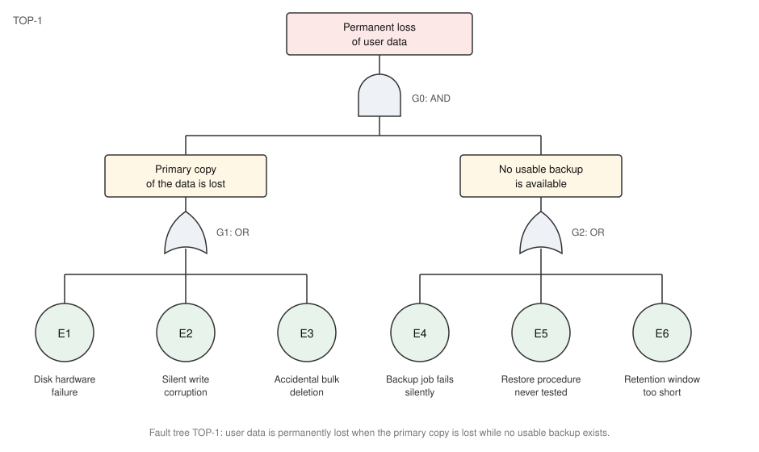
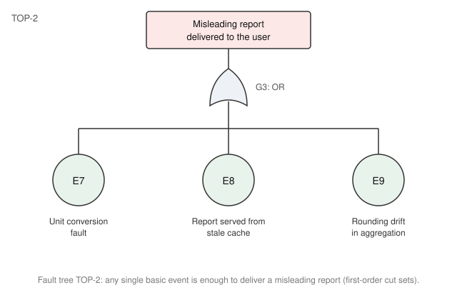

# Fault Tree Analysis Register

This registry holds the risks obtained from a Fault Tree Analysis (IEC 61025 style) of the product. FTA is a deductive, top-down technique: an undesired top event is postulated, and the combinations of basic events that can cause it are worked out through AND and OR gates. Two top events were analysed.

## Fault Trees

The first tree analyses the permanent loss of user data. The AND gate expresses that data is only lost for good when the primary copy is lost while, at the same time, no usable backup exists.

The second tree analyses the delivery of a misleading report. The OR gate expresses that every basic event is a first-order cut set: any one of them alone is enough to cause the top event.

## From Cut Sets to Records

Each record of this register corresponds to one minimal cut set — the smallest combination of basic events that triggers a top event. A cut set whose criticality is already in the acceptable band is screened out and carries no record.

| Cut Set | Basic Events | Record |
|---|---|---|
| {E1, E4} | Disk hardware failure while the backup job fails silently | FTA-001 |
| {E2, E5} | Silent write corruption replicated into backups that were never restore-tested | FTA-002 |
| {E3, E6} | Accidental bulk deletion discovered after the retention window | FTA-003 |
| {E7} | Unit conversion fault | FTA-004 |
| {E8} | Report served from stale cache | FTA-005 |
| {E9} | Rounding drift in aggregation | screened out: criticality 8, acceptable |

## Scales

Severity and Likelihood are scored on a ten-point scale; Likelihood reflects the estimated order of magnitude of the cut set's occurrence, so an AND-gated pair scores lower than either of its events alone.

| Value | Severity | Likelihood |
|---|---|---|
| 1 | No noticeable effect | Practically never |
| 4 | Degraded or misleading output | Possible within a product lifetime |
| 7 | Loss of function | Expected within a year |
| 10 | Irrecoverable data loss | Persistent |

The Criticality is Severity times Likelihood, computed for the cut set as first analysed. The Residual criticality uses the Residual Severity and Residual Likelihood sections, scored with the mitigation in place; a record without residual scores has not been mitigated yet and its Residual cell stays blank.

A criticality of 15 or below is acceptable, 35 or above is unacceptable and blocks the release until mitigated; the band between is tolerable while a mitigation is in progress.

## Lifecycle

Records move through Identified, Analysed, Mitigating, Accepted, and Closed. Every record whose current status is not Closed counts as open in the registries summary.
