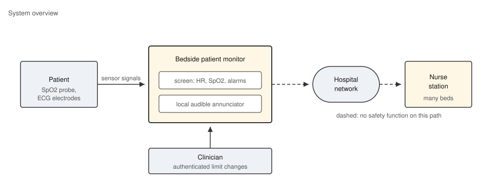
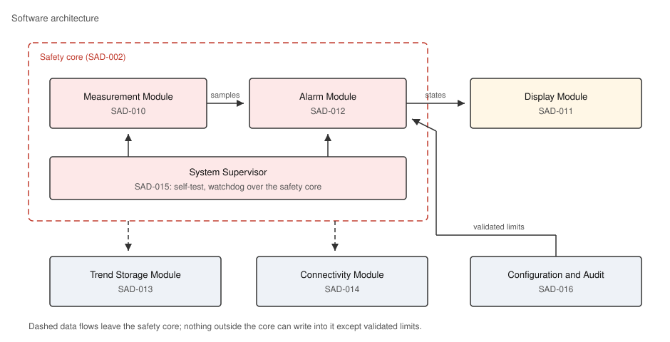

# Overview

This document describes the software architecture of the bedside patient monitor whose software requirements are stated in the Software Requirements Specification (srs). Architecture items in this document link up to the requirements they realize, and the software units in the Software Detailed Design (sdd) link up to the architecture items of this document.

# Architecture Principles

The following principles constrain every design decision in this architecture.

[SAD-001] Every safety function — measurement, display, and alarm annunciation — shall be performed locally on the device and shall not depend on the availability of the hospital network. >[SRS-007]

[SAD-002] The safety core (measurement, alarm, supervision) shall be separated from the convenience functions (trend storage, connectivity) so that a fault in a convenience function cannot stop measurement or alarm annunciation.

[SAD-003] The software shall start in a fail-safe manner: monitoring is entered only after the start-up self-test has passed, and a supervision function monitors the safety core at run time. >[SRS-008]

# System Overview

The monitor sits at the patient's bedside. It reads two sensors attached to the patient, shows the vital signs on its own screen, annunciates alarms locally, and forwards data over the hospital network to the central nurse station where one nurse observes many beds.

The device is autonomous: the nurse station is an observer, and the network path carries no safety function, as demanded by SAD-001.

# Software Architecture

The software is decomposed into six modules arranged around the safety core. The Measurement Module, the Alarm Module, and the System Supervisor form the safety core; the Display Module renders their outputs; the Trend Storage Module and the Connectivity Module consume measurement data without being able to influence the safety core, as demanded by SAD-002.

# Software Modules

[SAD-010] The Measurement Module shall acquire the raw sensor signals, filter them, and publish one validated heart-rate and SpO2 sample per second to the other modules. >[SRS-001]

[SAD-011] The Display Module shall render the published samples and the alarm states on the bedside screen and shall refresh the screen at least once per second. >[SRS-002]

[SAD-012] The Alarm Module shall compare every published sample against the configured alarm limits, shall manage the alarm state machine, and shall drive the visual and audible annunciators, including the bounded audible pause. >[SRS-003], >[SRS-004]

[SAD-013] The Trend Storage Module shall persist every published sample into a 72-hour trend store held in non-volatile memory. >[SRS-005]

[SAD-014] The Connectivity Module shall transmit published samples and alarm events to the nurse station and shall buffer them while the network is unavailable, isolating the safety core from network state. >[SRS-006], >[SRS-007]

[SAD-015] The System Supervisor shall execute the start-up self-test, shall gate the transition into monitoring mode on its result, and shall supervise the safety core modules at run time through a watchdog. >[SRS-008]

[SAD-016] The Configuration and Audit Module shall authenticate clinicians before permitting alarm-limit changes and shall write alarm events, settings changes, and detected faults into the persistent event log. >[SRS-009], >[SRS-010]

# Document History

| Revision | Description of changes | Date |
|---|---|---|
| A | Initial version | 2026-07-10 |
